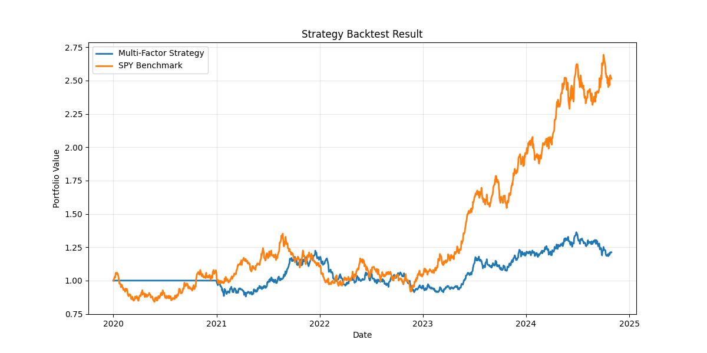
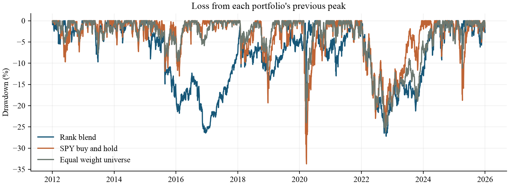

# ETF Multi-Factor Strategy

A reproducible study of momentum and low volatility across eight ETFs.

## Historical results

The October 2026 revision replaces simulated prices with historical adjusted closes, corrects execution timing, and includes trading costs. Evaluation: **2012-01-03 to 2025-12-31**, with 10 bps charged per dollar bought or sold.

| Portfolio | CAGR | Annual volatility | Maximum drawdown |
| --- | --- | --- | --- |
| Momentum and low-volatility rank blend | 7.83% | 12.20% | -27.21% |
| Equal-weight eight-ETF portfolio | 9.35% | 11.21% | -26.17% |
| SPY buy and hold | 14.76% | 16.67% | -33.72% |

The strategy had lower volatility than SPY but did **not** outperform either benchmark on CAGR or the reported zero-risk-free-rate Sharpe ratio. The earlier simulated-chart performance claims are superseded by these measured results.





Read the [revised paper (PDF)](paper/ETF_Research_Revised.pdf), [editable paper (Word)](paper/ETF_Research_Revised.docx), or [plain-text paper](paper/ETF_Research_Revised.md). All six portfolios and 36 sensitivity cases are in [results](results/).


This is the October 2026 revision of Carson Chen's ETF capstone prototype. It preserves the original idea: combine recent price strength with a preference for lower volatility. The original four scripts, figures and README are archived in `original/`. The new implementation and paper were developed with AI assistance; they must not be described as work completed in the earlier capstone without that distinction.

## What changed

- Actual historical adjusted closes replace random prices. Failed downloads stop explicitly.
- The original eight-ETF universe is retained: SPY, QQQ, IWM, EFA, VNQ, GLD, TLT, LQD. This release makes no claim of screening 100+ ETFs.
- Source files, timestamps and SHA-256 checksums make the data snapshot traceable and reusable offline.
- Signals use completed trading sessions. Month-end signals execute at the following trading close and earn returns only afterward.
- Holdings drift between monthly rebalances. No uncharged daily rebalancing is assumed.
- Trades pay 10 basis points per dollar bought or sold, including the initial purchase. Selling one dollar and buying one dollar costs two dollars times the fee rate.
- Every comparison starts with cash on the same first evaluation session, after the factor warm-up. SPY is bought at that session's close.
- Percentile ranks give momentum and low volatility comparable scales. The original raw subtraction is retained as an explicit comparison, not silently replaced.
- Six strategies, annual returns, two descriptive subperiods and a 36-case sensitivity grid are reported. The default is not selected to maximize past returns.
- The paper derives its numerical tables directly from exported results.

## Run

Python 3.12 was used. From this directory:

```sh
python3 -m venv .venv
source .venv/bin/activate
python -m pip install -r requirements.txt
python research.py download
python research.py run
python publish_figures.py
python -m unittest discover -s tests -v
python audit_results.py
```

Run `download` once after cloning: raw provider data are not distributed in this public repository. Thereafter, `python research.py run` uses your saved cache and requires no network. `python research.py all` downloads and runs. `config.json` controls the universe, dates, lookback, portfolio size, factor weight and cost. A changed universe or date request requires a fresh download. The exact package versions used for the delivered run are recorded in `results/run_manifest.json` and `requirements-lock.txt`.

The default uses data from 2010 through the end of 2025 and evaluates 2012-2025. The end date is exclusive. Keeping the last complete calendar year avoids mixing a partial 2026 with full-year statistics.

To regenerate the editable paper after a research run, install `requirements-paper.txt`, run `python audit_results.py`, then `python build_paper.py`. Convert the resulting DOCX to PDF using Word or LibreOffice and check every page. The supplied PDF is the visually checked export of the supplied DOCX. Tests use small artificial fixtures solely to check accounting, not as performance evidence.

## Method

Momentum is the trailing 252-session adjusted-price return. Volatility is the sample standard deviation of the last 252 daily returns times the square root of 252. On each month's final observed session, rank momentum and negative volatility separately across ETFs using average ranks for ties. The default score is 0.5 times each percentile rank. Select two ETFs at equal target weights. Final score ties use the ticker order in `config.json`.

The score uses information through the signal close. The trade occurs at the next trading close, after that day's existing holdings have earned their return. This conservative delay avoids assuming that the final closing price was known before trading at that same price. Adjusted-price portfolio units approximate reinvested dividends; this is not a broker execution simulator.

Cash earns zero. Positions are long only, with no leverage or short selling. Fees are solved against post-fee wealth so the portfolio is self financing. A 50% target is not a continuous position cap: a winning holding can drift above 50% between rebalances. There is no stop loss, guaranteed floor or volatility target.

## Output map

| File | Contents |
| --- | --- |
| `data/manifest.json` | Provider, dates, symbols, download timestamp and hashes |
| `data/adjusted_close.csv` | Verified daily adjusted-close research snapshot |
| `results/summary.csv` | Full-period return, risk and trading activity |
| `results/annual_returns.csv` | Calendar-year net returns for all six strategies |
| `results/subperiods.csv` | 2012-2019 and 2020-2025 descriptive comparisons |
| `results/sensitivity.csv` | All 36 parameter/cost variants, including weak outcomes |
| `results/*_daily.csv` | Daily net returns, wealth, traded notional and fees |
| `results/*_trades.csv` | Signal date, execution date, target weights and fees |
| `results/*_weights.csv` | Actual end-of-day weights after price drift |
| `results/monthly_targets.csv` | Default model's monthly research signals |
| `paper/ETF_Research_Revised.docx` | Editable English research paper |
| `paper/ETF_Research_Revised.pdf` | Print-ready English research paper |

## How to interpret the statistics

CAGR compounds net wealth using 252 observations per year. Volatility is daily sample standard deviation times sqrt(252). Sharpe uses a zero risk-free rate, stated explicitly; it is not a Treasury-adjusted Sharpe. Maximum drawdown includes the initial wealth of one. Annual traded notional is the sum of purchases plus sales divided by sample years; it is not the half-turnover convention.

SPY is a familiar equity opportunity-cost benchmark, while the monthly equal-weight eight-ETF portfolio is a closer asset-universe benchmark. Neither is risk-matched to the strategy. The momentum-only and low-volatility-only portfolios isolate each scoring input. The raw blend uses the original score with the corrected execution engine and real data, so it is not a reproduction of the original synthetic chart.

## Limits

This is retrospective research, not a prospective out-of-sample test. All dates were already historical when the revision was designed. The two subperiods are descriptive, not untouched train/test sets. The sensitivity grid is not an optimizer, and none of its outcomes justify a claim of future profitability.

Eight surviving ETFs were chosen in the original prototype; selection and survivorship bias remain. Vendor-adjusted prices may be revised and were not independently reconciled to a second provider. No delisted funds, taxes, changing spreads, order-size capacity, market impact, currency conversion or realistic cash interest are modeled. Fund operating expenses are reflected in observed fund prices and are not separately subtracted. Correlated ETFs can leave even a two-position portfolio concentrated.

Raw provider data are excluded from this public repository. Run the downloader to obtain your own research copy. `data/reference_manifest.json` records the snapshot used in the published results; later vendor revisions may change a new download. This repository contains no live-trading integration.

## References

- yfinance download API: https://ranaroussi.github.io/yfinance/reference/api/yfinance.download.html
- Moskowitz, Ooi and Pedersen (2012), Time Series Momentum: https://www.aqr.com/Insights/Research/Journal-Article/Time-Series-Momentum
- Frazzini and Pedersen (2014), Betting Against Beta: https://www.aqr.com/Insights/Research/Journal-Article/Betting-Against-Beta
- Bailey, Borwein, Lopez de Prado and Zhu, The Probability of Backtest Overfitting: https://www.davidhbailey.com/dhbpapers/backtest-prob.pdf

The academic papers motivate research questions; this small long-only ETF model is not a replication of their strategies.
