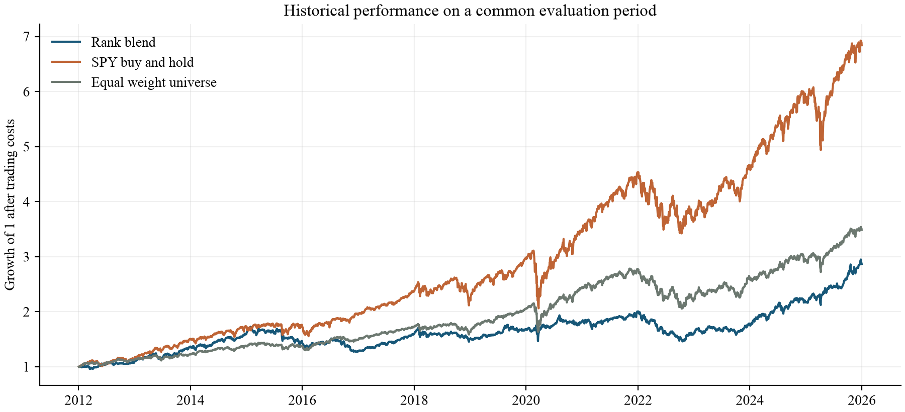

Evaluating Momentum and Low Volatility in an ETF Portfolio

Carson Chen
Revised capstone study  |  October 2026

# Abstract

This study evaluates a transparent long-only ETF selection rule combining trailing momentum and low volatility. It replaces an earlier simulated-price prototype with a documented historical-data experiment. Eight ETFs are observed from 2010 through 2025, with a common evaluation period of 2012-01-03 to 2025-12-31. The default portfolio selects two ETFs monthly using equally weighted percentile ranks and executes at the next trading close. Trading costs are charged at 10 basis points per dollar bought or sold. The portfolio achieves a compound annual growth rate of 7.83%, annualized volatility of 12.20%, and a maximum drawdown of -27.21%. SPY produces a higher CAGR of 14.76% with higher volatility, while an equal-weight portfolio of the same eight ETFs earns 9.35% with lower volatility than the factor portfolio. The results do not establish superiority over passive alternatives. The main contribution is a reproducible test of a risk-return hypothesis, including weaker outcomes, implementation controls, and parameter sensitivity.

# Research question

Does combining recent price strength with a preference for lower volatility improve the observed return-risk trade-off relative to momentum alone, low volatility alone, and simple passive alternatives? The question is evaluated through returns, volatility, drawdowns and trading activity rather than through a single favorable chart.

The motivating intuition is straightforward: momentum seeks continued strength, while the volatility component discourages unstable price histories. Neither input guarantees a future return or a floor on losses. The combination is a hypothesis about selection, not an insurance contract or a formally optimized portfolio.

# Scope of the revision

The archived prototype used randomly generated paths labeled with eight ETF tickers. It was useful for demonstrating a workflow, but its output cannot establish historical market performance. This revision retains those eight tickers and the original idea, introduces actual adjusted prices and corrected accounting, and reports the resulting evidence. It does not claim a universe of more than 100 ETFs or attribute the present revision to the earlier project period.

# Data and research context

## Historical data

Daily adjusted closes were downloaded from Yahoo Finance through yfinance with auto_adjust=True [1]. The snapshot contains 4,024 observations per ETF, from 2010-01-04 through 2025-12-31. The request end date is exclusive. The download was completed on 2026-10-07 UTC. Data from 2010-2011 provide pre-evaluation history; reported portfolio performance begins in January 2012. The sample ends with the last full calendar year, 2025.

| Ticker | Exposure represented |
| --- | --- |
| SPY | US large-cap equities |
| QQQ | Nasdaq-100 equities |
| IWM | US small-cap equities |
| EFA | Developed equities outside the US and Canada |
| VNQ | US listed real estate |
| GLD | Gold |
| TLT | Long-duration US Treasury bonds |
| LQD | US dollar investment-grade corporate bonds |

Adjusted closes provide an approximate total-return series incorporating the vendor's dividend and split adjustments. They are not raw executable prices. The model treats changes in adjusted prices as changes in reinvested portfolio units. Fund operating expenses already affect the observed series and are not deducted a second time. Taxes and investor-specific dividend treatment are excluded.

The downloader rejects empty responses, missing observations, duplicate dates, nonpositive prices and inconsistent symbol sets. It does not replace failed downloads with random values or forward-fill prices. Individual provider files and the consolidated series are saved with checksums and a download manifest. The research can then be rerun offline from this snapshot.

## Related work

Moskowitz, Ooi and Pedersen [2] study time-series momentum across futures and forward contracts. Their work motivates examining past returns but does not validate this ETF rule: the present strategy ranks assets relative to one another and remains long only. Frazzini and Pedersen [3] study low-beta investing, which is related to defensive investing but differs from ranking ETFs on total historical volatility. Neither study is replicated here.

Bailey and coauthors [4] explain the danger of selecting strategies after examining many backtests. Accordingly, this study reports its parameter grid as a sensitivity exercise and does not promote its best historical setting as a validated trading rule.

# Factor construction and portfolio rules

## Momentum and volatility

For each ETF, daily return equals today's adjusted close divided by the previous session's adjusted close, minus one. Momentum is the analogous price ratio over 252 sessions. Volatility is the sample standard deviation of the last 252 daily returns, multiplied by the square root of 252. All observations used in a signal are available by that signal's closing date.

Momentum = adjusted close today / adjusted close 252 sessions earlier - 1

Annualized volatility = sample standard deviation of 252 daily returns × square root of 252

The lookback uses trading observations rather than calendar days. There is no one-month momentum skip. A signal is eligible only when both inputs are available for every ETF in the configured universe.

## Combining comparable scores

The original prototype directly subtracted volatility from momentum. Both are numerical rates, but their cross-sectional spreads differ, so equal coefficients do not ensure equal influence. The revised default first converts momentum and negative volatility into percentile ranks across the eight ETFs. A larger value is better for both transformed inputs.

Composite score = 0.5 × momentum percentile rank + 0.5 × low-volatility percentile rank

Average ranks are used for tied input values. If final scores tie, the configured ticker order breaks the tie deterministically. This transparent convention can affect a small universe and is not evidence that the tied assets have different expected returns. Ranks also discard information about the magnitude of differences, so normalization is a design choice rather than an assured performance improvement.

## Selection and execution

At the final observed trading session of each month, the two highest-scoring ETFs receive target weights of 50% each. The signal is executed at the next observed trading close. Existing holdings earn that next session's price change before the trade; new holdings earn returns afterward. This one-session delay avoids assuming that a closing-price signal could have been known before trading at the same close.

Holdings drift with prices until the following rebalance. The 50% allocation is a target at rebalance, not a continuous cap. There is no leverage, short position, stop loss, cash-switching rule, trend-sign filter or guaranteed downside floor. The strategy remains invested even when every ETF has negative momentum.

The last monthly signal is stored for reproducibility even if its execution date lies beyond the sample. Such an unexecuted signal contributes no return to the reported backtest.

# Accounting and evaluation design

## Costs and self financing

Every purchase and sale is charged 10 basis points of its traded dollar value. Selling a position and buying a replacement incurs costs on both legs. At each rebalance, the engine solves the fee against post-fee wealth before allocating the new target holdings. This prevents fees from creating an implicit borrowing balance. Initial purchases are charged; terminal liquidation is not assumed. Cash earns zero.

For example, investing one unit of cash at a 0.1% purchase cost leaves 1 / 1.001 units invested. A flat market therefore produces a small initial loss, which is included in both performance and drawdown. The constant fee is a stylized all-in trading friction, not an estimate of every ETF's historical spread or market impact.

## Comparisons

| Portfolio | Purpose |
| --- | --- |
| Rank blend | Default equal-weight combination of the two ranks |
| Raw blend | Original momentum minus volatility score, corrected execution |
| Momentum only | Isolates recent-return selection |
| Low volatility only | Isolates defensive selection |
| Equal weight universe | Monthly equal weights across the same eight ETFs |
| SPY buy and hold | Single purchase of the equity benchmark |

All portfolios start from one unit of cash and trade at the same first evaluation close. The factor warm-up is excluded from every performance series. SPY measures equity opportunity cost; the equal-weight universe is a closer asset-coverage comparison. Neither benchmark is matched to the factor portfolio's risk exposure.

## Performance measures

CAGR compounds final wealth over the number of observations divided by 252. Annualized volatility uses daily sample standard deviation. Sharpe is the annualized daily mean divided by annualized volatility, with an explicitly assumed zero risk-free rate. Maximum drawdown measures the largest decline from the running wealth peak, including initial capital. Annual traded notional sums purchases and sales and divides by sample years; it is not half-turnover.

## Verification

Eleven deterministic tests cover signal timing, future-data independence, trading-calendar edges, price validation, price-driven weight drift, self-financing costs and metric definitions. A separate audit reconstructs every daily portfolio value from the persisted target orders and price ratios, verifies next-session execution, checks a direct SPY endpoint calculation and confirms that higher costs reduce each grid variant's CAGR.

# Full period results

The common evaluation window contains 3,520 sessions from 2012-01-03 through 2025-12-31. Table 1 reports net results. The rank blend ends at 2.868 units for each initial unit, compared with 3.487 for the equal-weight universe and 6.841 for SPY.

Table 1  Net performance over the full evaluation period

| Portfolio | CAGR | Volatility | Sharpe | Max drawdown |
| --- | --- | --- | --- | --- |
| Rank blend | 7.83% | 12.20% | 0.68 | -27.21% |
| Raw blend | 8.19% | 13.36% | 0.66 | -25.52% |
| Momentum only | 7.50% | 14.47% | 0.57 | -32.47% |
| Low volatility only | 5.58% | 9.75% | 0.61 | -27.61% |
| Equal weight universe | 9.35% | 11.21% | 0.85 | -26.17% |
| SPY buy and hold | 14.76% | 16.67% | 0.91 | -33.72% |

Figure 1  Growth of one unit after trading costs. All portfolios share the same start and end dates.

Relative to momentum alone, the rank blend has a higher CAGR (7.83% versus 7.50%) and lower volatility (12.20% versus 14.47%). This supports a narrow descriptive benefit from combining the inputs within this universe and period.

The broader claim fails: the rank blend trails the equal-weight universe in CAGR and Sharpe, with higher volatility and a larger maximum drawdown. Against SPY it reduces measured volatility and drawdown but gives up substantial growth. The raw blend earns 8.19%, above the rank blend's CAGR, while its Sharpe is lower. Rank normalization therefore does not dominate the original score.

# Drawdowns and changing conditions

Figure 2  Net drawdowns relative to each portfolio's own previous peak, including initial capital.

The default portfolio's maximum drawdown is -27.21%. Low-volatility selection therefore does not establish a loss floor. In 2022 the rank blend loses 19.51%, compared with a 18.18% loss for SPY. The simple intuition of protecting the downside is not reliable in every calendar year.

Table 2  Descriptive subperiod results for the default and benchmarks

| Portfolio | Period | CAGR | Sharpe |
| --- | --- | --- | --- |
| Rank blend | 2012-2019 | 6.67% | 0.65 |
| Rank blend | 2020-2025 | 9.41% | 0.72 |
| Equal weight universe | 2012-2019 | 9.40% | 1.15 |
| Equal weight universe | 2020-2025 | 9.30% | 0.69 |
| SPY buy and hold | 2012-2019 | 14.55% | 1.13 |
| SPY buy and hold | 2020-2025 | 15.03% | 0.78 |

Subperiod statistics use the actual continuous strategy returns within each interval; portfolios are not reset or selected again at the split. Drawdowns for a subperiod, available in the exported table, are measured from wealth rebased at that interval's start. The labels are descriptive and must not be interpreted as an untouched validation set.

The low-volatility-only portfolio changes markedly across the two intervals: its CAGR is 8.56% in 2012-2019 and 1.74% in 2020-2025. This variation cautions against treating a defensive historical characteristic as a stable return advantage. No causal attribution to a particular economic event is estimated here.

# Sensitivity to modeling choices

The fixed grid varies the lookback across 126 and 252 sessions, the portfolio size across two and three ETFs, the momentum weight across 0.25, 0.50 and 0.75, and costs across 0, 10 and 25 basis points. All 36 combinations are exported. These cases are robustness checks; the default remains the equal-weight rank blend with a 252-session lookback and two positions.

Table 3  CAGR across signal settings at 10 basis points per traded dollar

| Lookback | Positions | 25% momentum | 50% momentum | 75% momentum |
| --- | --- | --- | --- | --- |
| 126 | 2 | 6.11% | 6.65% | 6.85% |
| 126 | 3 | 4.32% | 7.17% | 8.40% |
| 252 | 2 | 5.80% | 7.83% | 8.86% |
| 252 | 3 | 6.03% | 7.57% | 7.47% |

Table 4  Trading cost sensitivity of the default signal

| Cost in bps | CAGR | Sharpe | Max drawdown |
| --- | --- | --- | --- |
| 0 | 8.52% | 0.73 | -26.90% |
| 10 | 7.83% | 0.68 | -27.21% |
| 25 | 6.82% | 0.60 | -28.42% |

Across the entire grid, observed CAGR ranges from 3.70% to 9.58%. At the default signal settings, raising costs from zero to 25 basis points reduces CAGR from 8.52% to 6.82%. The default portfolio trades approximately 6.32 times portfolio wealth per year in combined purchases and sales, compared with 0.37 for the equal-weight universe. Its extra selection activity creates a meaningful cost burden.

The grid is not a search for a winning headline. Even an attractive setting would be a retrospective finding requiring a genuinely new sample. The experiment does not adjust for multiple testing, estimate a probability of backtest overfitting, or calculate confidence intervals for differences between portfolios. The evidence is descriptive rather than a statistical claim of alpha.

## What the comparison establishes

Combining factors can change the risk-return profile without beating simpler alternatives. Normalization changes which assets are selected, costs affect compounded outcomes, and the evaluation window changes how a strategy looks. These implementation choices are part of the research question rather than details to hide after selecting a favorable result.

# Limitations and conclusions

## Limits of the evidence

The universe consists of eight surviving ETFs carried forward from the prototype. It is neither a historical census nor a point-in-time screen of all available funds. Selection and survivorship bias remain. The model has no delisting treatment or dynamic eligibility rules; adding newer funds would require explicit inception and missing-data policies.

The adjusted-close snapshot comes from one public data provider and has not been reconciled against an independent source. Provider revisions can change later downloads. Complete observations and checksums improve reproducibility, but they do not certify economic correctness. An actual execution system would require raw prices, distribution accounting and instrument-specific trade constraints.

Only a constant trading friction is modeled. Historical bid-ask spreads, taxes, market impact, liquidity constraints and order size are omitted. Cash earns no interest, and Sharpe uses a zero risk-free rate. Ranking on volatility does not manage correlations or guarantee diversification; two selected ETFs may share substantial exposures.

The test begins after the 2008 financial crisis, so that episode is not represented. Although the sample includes multiple later conditions, it is limited to one realized market path. All observations were historical when this revision was developed. A split at 2020 is not a prospective test, and neither the full sample nor the sensitivity grid establishes live-trading readiness.

## Conclusion

The original idea survives as a testable hypothesis, not as a confirmed claim of market outperformance. Over this historical sample, the equal-weight rank blend earns 7.83% annually after the stated costs and experiences a 27.21% peak-to-trough loss. It improves selected metrics relative to momentum-only selection, but it does not outperform the equal-weight universe or SPY on CAGR or the reported Sharpe measure. The low-volatility component changes exposure; it does not insure the portfolio.

The project is stronger because its inputs, rules and limitations can now be inspected and its results reproduced. A sensible next research stage would freeze the present specification before observing new data, evaluate a future paper-trading period, and reconcile market data independently. Those steps are proposed future work, not completed achievements.

## Revision provenance

The original four-script prototype and original paper are retained in the project archive. This October 2026 revision was prepared with AI assistance for implementation, testing, analysis and writing. The historical experiment, accounting corrections, comparison portfolios and updated findings belong to this revision. The paper makes no claim that these additions were completed during the original capstone or that the student independently authored every new component.

# Reproducibility and references

## Research package

The accompanying folder includes the original materials, configuration, documented source code, a verified price snapshot, daily returns, actual weights, trade ledgers, annual returns, subperiod tables, the full sensitivity grid, tests and this editable paper. The run manifest records package versions and hashes of both the data and research code.

| Item | Recorded value |
| --- | --- |
| Data source | Yahoo Finance through yfinance |
| Snapshot dates | 2010-01-04 to 2025-12-31 |
| Evaluation dates | 2012-01-03 to 2025-12-31 |
| Universe and evaluation rows | 8 ETFs; 3,520 daily rows per portfolio |
| yfinance and pandas | 1.7.0 and 2.2.3 |
| Default cost | 10 bps per dollar purchased or sold |
| Audit result | PASS |

To reproduce results, install the dependencies, run research.py run against the saved data, execute the tests, and run audit_results.py. The download command is separate so a later vendor revision does not silently replace the submitted snapshot. build_paper.py reads the exported metrics; the document can be regenerated after a new experiment. The README contains exact commands and definitions.

## References

[1] yfinance. Download API documentation. Accessed October 7, 2026. https://ranaroussi.github.io/yfinance/reference/api/yfinance.download.html

[2] Moskowitz, T. J., Ooi, Y. H., and Pedersen, L. H. (2012). Time series momentum. Journal of Financial Economics, 104(2), 228-250. https://doi.org/10.1016/j.jfineco.2011.11.003

[3] Frazzini, A., and Pedersen, L. H. (2014). Betting against beta. Journal of Financial Economics, 111(1), 1-25. https://doi.org/10.1016/j.jfineco.2013.10.005

[4] Bailey, D. H., Borwein, J. M., Lopez de Prado, M., and Zhu, Q. J. The probability of backtest overfitting. Author-hosted manuscript. https://www.davidhbailey.com/dhbpapers/backtest-prob.pdf

[5] Chen, C. ETF Multi-Factor Strategy. Original local four-script prototype and capstone paper, preserved in original/. Current revised source, data manifest and results accompany this paper.

Sources [2]-[4] provide conceptual context and methodological cautions. All portfolio statistics in this paper are computed from the accompanying local experiment; none are performance claims borrowed from those publications.
